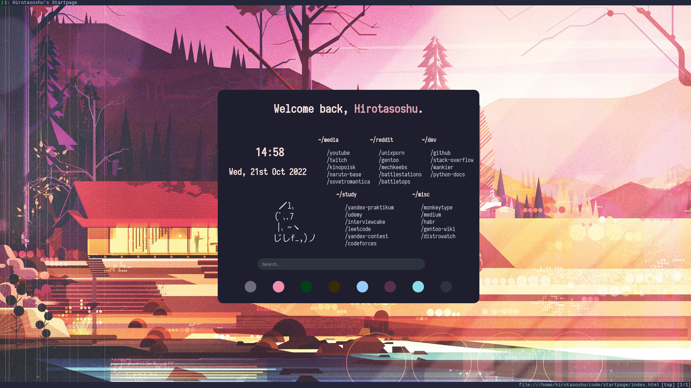

# 
# startpage



## 👇 Index

- [👇 Index](#-index)
- [⚙️ Installation](#️-installation)
- [🎨 Customization](#-customization)

## ⚙️ Installation

1. Clone this repo with `git clone https://github.com/hirotasoshu/startpage.git`
1. Set index.html as a startpage for your browser. For example, in qutebrowser you just need to add this line to config.py:

```python
c.url.start_pages = ["file:///home/hirotasoshu/code/startpage/index.html"]
```
## 🎨 Customization

If you want to edit links, just edit `index.html`.

If you want to change background and colors, change `catppuccin.css`.

If you want to change css grid, edit `index.css`.

